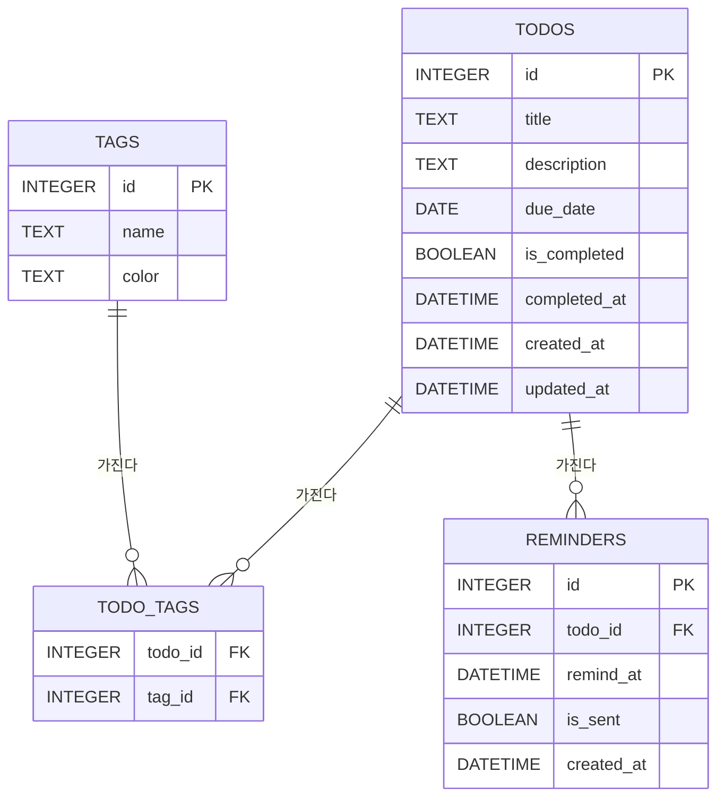

# Todo 앱 DB 구조 설계

로컬 단일 사용자 · 파일 기반 SQLite를 기준으로, 기본 CRUD와 마감일·태그·오늘 할 일·검색·알림까지
전부 담을 수 있는 4개 테이블 구조입니다.

**스택**: SQLite · 테이블 4개 · 다대다 태그 · 알림 전용 테이블

---

## ER 다이어그램

todos를 중심으로 tags는 다대다, reminders는 일대다로 연결됩니다.



---

## 테이블별 상세

핵심 엔티티 → 태그 → 연결 테이블 → 알림 순서로 쌓입니다.

### 01. todos — 할 일 본체

CRUD·완료·마감일의 중심

| 컬럼 | 타입 | 설명 |
|---|---|---|
| `id` **PK** | INTEGER | 자동 증가 기본키 |
| `title` | TEXT NOT NULL | 할 일 제목 |
| `description` | TEXT | 상세 메모 (선택) |
| `due_date` | DATE | 마감일 — "오늘 할 일" 필터·정렬 기준 |
| `is_completed` | BOOLEAN DEFAULT 0 | 완료 표시 |
| `completed_at` | DATETIME | 완료 처리 시각 (통계용, 선택) |
| `created_at` | DATETIME DEFAULT now | 생성 시각 |
| `updated_at` | DATETIME | 마지막 수정 시각 |

### 02. tags — 카테고리(태그) 사전

한 번 만들면 재사용

| 컬럼 | 타입 | 설명 |
|---|---|---|
| `id` **PK** | INTEGER | 자동 증가 기본키 |
| `name` | TEXT UNIQUE NOT NULL | 태그 이름 (예: 업무, 개인, 급함) |
| `color` | TEXT | 목록에서 구분할 색상 코드 (선택) |

### 03. todo_tags — 연결 테이블

todos ↔ tags 다대다

| 컬럼 | 타입 | 설명 |
|---|---|---|
| `todo_id` **PK/FK** | INTEGER | todos.id 참조 |
| `tag_id` **PK/FK** | INTEGER | tags.id 참조 |

### 04. reminders — 마감일 알림

할 일 하나에 여러 알림 시각을 걸 수 있는 별도 테이블

| 컬럼 | 타입 | 설명 |
|---|---|---|
| `id` **PK** | INTEGER | 자동 증가 기본키 |
| `todo_id` **FK** | INTEGER NOT NULL | todos.id 참조 |
| `remind_at` | DATETIME NOT NULL | 알림 발생 시각 (마감일 하루 전, 1시간 전 등 자유롭게) |
| `is_sent` | BOOLEAN DEFAULT 0 | 중복 발송 방지 플래그 |
| `created_at` | DATETIME DEFAULT now | 생성 시각 |

---

## PRD 기능 ↔ 테이블 매핑

| 기능 | 구현 위치 |
|---|---|
| 마감일 표시 | `todos.due_date` |
| 카테고리(태그) | `tags` + `todo_tags` (다대다) |
| 오늘 할 일만 보기 | `WHERE due_date = date('now')` |
| 검색 | `WHERE title LIKE '%키워드%'` (또는 FTS5) |
| 마감일 알림 설정 | `reminders` 테이블 (`remind_at`, `is_sent`) |

---

## 설계 이유

**→ 태그를 컬럼 하나가 아니라 별도 테이블 + 연결 테이블로 뒀어요**
할 일 하나에 태그 여러 개("업무" + "급함")를 붙이는 게 자연스럽고, 태그 이름을 나중에 바꿔도 todos 테이블을 건드릴 필요가 없습니다. 카테고리처럼 "하나만" 쓰고 싶다면 todo_tags 대신 `todos.category_id` 컬럼 하나로 줄여도 됩니다.

**→ 알림을 todos에 컬럼으로 넣지 않고 reminders 테이블로 분리했어요**
"마감 하루 전"과 "마감 1시간 전"처럼 할 일 하나에 알림을 여러 개 걸 수 있게 하려면 별도 테이블이 필요합니다. 알림이 딱 하나면 `todos.remind_at` 컬럼 하나로 단순화해도 무방합니다.

**→ users(사용자) 테이블은 넣지 않았어요**
"내 컴퓨터에서 도는" 단일 사용자 로컬 앱이라 로그인 없이 todos가 곧 내 데이터입니다. 나중에 로그인을 붙이게 되면(직접 구현 대신 검증된 라이브러리로) todos에 `user_id` FK 컬럼만 추가하면 됩니다.

**→ 인덱스는 due_date, is_completed, remind_at + is_sent에 걸어두면 좋아요**
"오늘 할 일만 보기"는 due_date로 매번 필터링하고, 알림 기능은 백그라운드에서 "아직 안 보낸(is_sent=0) 데다 시간이 된(remind_at)" 행을 주기적으로 훑으므로 이 조합에 인덱스가 없으면 데이터가 늘수록 느려집니다.

---

## SQLite DDL

그대로 실행해서 시작할 수 있는 CREATE TABLE 문입니다.

```sql
-- 1. 할 일 본체
CREATE TABLE todos (
  id            INTEGER PRIMARY KEY AUTOINCREMENT,
  title         TEXT NOT NULL,
  description   TEXT,
  due_date      DATE,
  is_completed  BOOLEAN NOT NULL DEFAULT 0,
  completed_at  DATETIME,
  created_at    DATETIME NOT NULL DEFAULT CURRENT_TIMESTAMP,
  updated_at    DATETIME NOT NULL DEFAULT CURRENT_TIMESTAMP
);

-- 2. 태그 사전
CREATE TABLE tags (
  id     INTEGER PRIMARY KEY AUTOINCREMENT,
  name   TEXT NOT NULL UNIQUE,
  color  TEXT
);

-- 3. todos ↔ tags 다대다 연결
CREATE TABLE todo_tags (
  todo_id  INTEGER NOT NULL REFERENCES todos(id) ON DELETE CASCADE,
  tag_id   INTEGER NOT NULL REFERENCES tags(id)  ON DELETE CASCADE,
  PRIMARY KEY (todo_id, tag_id)
);

-- 4. 마감일 알림
CREATE TABLE reminders (
  id          INTEGER PRIMARY KEY AUTOINCREMENT,
  todo_id     INTEGER NOT NULL REFERENCES todos(id) ON DELETE CASCADE,
  remind_at   DATETIME NOT NULL,
  is_sent     BOOLEAN NOT NULL DEFAULT 0,
  created_at  DATETIME NOT NULL DEFAULT CURRENT_TIMESTAMP
);

-- 자주 쓰는 조회에 맞춘 인덱스
CREATE INDEX idx_todos_due_date     ON todos(due_date);
CREATE INDEX idx_todos_is_completed ON todos(is_completed);
CREATE INDEX idx_reminders_pending  ON reminders(is_sent, remind_at);
```

---

검색을 제목/설명 전문 검색으로 확장하고 싶으면 SQLite의 FTS5 가상 테이블을 todos 위에 얹는 방법도 있습니다 — 지금 구조를 바꾸지 않고 나중에 추가만 하면 됩니다.
